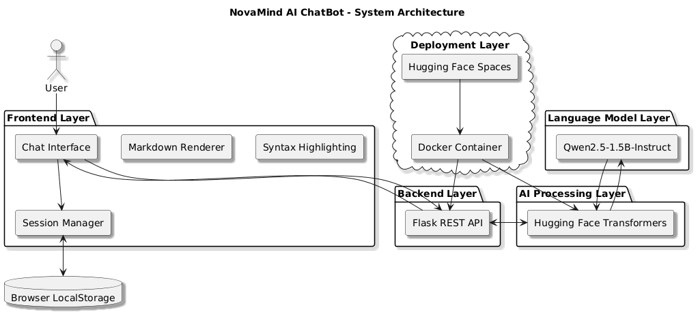

<div align="center">

# 🤖 NovaMind AI ChatBot

### Intelligent Conversational AI Powered by Qwen2.5-1.5B-Instruct

A modern AI chatbot featuring multi-session conversations, persistent chat history, markdown rendering, syntax-highlighted code responses, and deployment on Hugging Face Spaces.

<br>


<br><br>

### 🚀 Live Demo

**NovaMind AI ChatBot**
https://huggingface.co/spaces/Chaitanya182004/NovaMindAiChatBot

</div>

---

## 🌟 Overview

NovaMind AI ChatBot is a full-stack conversational AI application built using Flask, Hugging Face Transformers, PyTorch, and the Qwen2.5-1.5B-Instruct Large Language Model.

The application delivers a modern conversational AI experience through intelligent response generation, multi-session chat management, persistent conversation history, markdown rendering, syntax-highlighted code responses, and a responsive user interface.

Designed as a lightweight yet powerful AI assistant, NovaMind demonstrates the integration of Large Language Models (LLMs) into a production-ready web application deployed on Hugging Face Spaces.

---

## 🏗️ System Architecture

<p align="center">
  
</p>

<p align="center">
  <sub>
  High-Level Architecture of NovaMind AI ChatBot
  </sub>
</p>

---

## 🛠️ Technology Stack

| Layer                | Technology                  |
| -------------------- | --------------------------- |
| Frontend             | HTML5, CSS3, JavaScript     |
| Backend              | Flask                       |
| Programming Language | Python                      |
| AI Framework         | Hugging Face Transformers   |
| Deep Learning        | PyTorch                     |
| Language Model       | Qwen2.5-1.5B-Instruct       |
| Storage              | Browser LocalStorage        |
| Deployment           | Docker, Hugging Face Spaces |

---

## 📂 Project Structure

```bash
NovaMind-AI-ChatBot/
│
├── app.py
├── requirements.txt
├── Dockerfile
│
├── templates/
│   └── index.html
│
├── static/
│   ├── script.js
│   ├── style.css
│   └── robot.png
│
├── assets/
│   └── architecture.png
│
└── README.md
```
